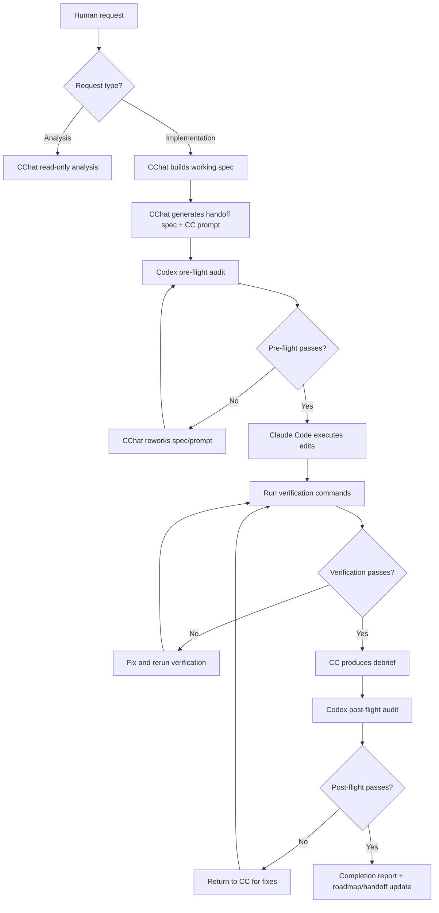

# Operator AI Orchestration Flow

## Why this exists

This is the practical operating model for running enterprise-grade delivery as a solo operator:

- Human sets intent and constraints.
- CChat (Claude Chat 4.6 Opus) performs governed discovery, maps execution, and generates the CC prompt.
- Codex audits the handoff spec + CC prompt (mandatory pre-flight) and audits CC's output (mandatory post-flight).
- Claude Code executes changes and verification.
- Verification layers prevent false completion.

This flow is the reason a small team (or one operator) can move at high speed without abandoning safety.

## Core control files

- Unified brain (execution + planning protocol): `/steampunk-strategy/CLAUDE.md`
- Codex QA contract: `/steampunk-strategy/docs/CODEX.md`
- Codex QA audit preamble: `/steampunk-strategy/docs/CODEX-PREAMBLE.md`
- Handoff verifier: `/steampunk-strategy/scripts/verify-handoff.mjs`
- Operator triage reference: `/steampunk-strategy/docs/operator-stoppage-cheat-card.md`
- Archived (retired): `/steampunk-strategy/docs/archive/copilot-instructions-retired.md`

## End-to-end flow (human to delivery)

## Decision gates (what happens when you ask for work)

1. **Intent gate**
   - CChat classifies request: analysis-only, handoff prep, or implementation.

2. **Mode gate (risk-aware execution)**
   - **Mapped Mode** for GenAI, protocol-sensitive, or cross-repo work.
   - **Lean Mode** only for low-risk, simple scoped tasks.
   - Lean escalates to Mapped if ambiguity/risk/scope increases.

3. **Pre-flight gate (mandatory)**
   - Codex audits CChat's handoff spec + CC prompt before execution begins.
   - Work does not proceed to CC until Codex issues PASS or PASS WITH CORRECTIONS.

4. **Preflight-unblock gate**
   - If canonical handoff files are missing but details are complete inline, canonical files are created first, then execution proceeds.

5. **Verification gate**
   - Work is not complete until required checks pass.

6. **Post-flight gate (mandatory)**
   - Codex audits CC's debrief against acceptance criteria.
   - Handoff is not closed until Codex issues PASS or PASS WITH NOTES.

## Role specialization (why each AI is used)

- **CChat (Claude Chat 4.6 Opus — The Strategist):**
  - High-fidelity codebase archaeology and discovery.
  - Dependency mapping and risk detection.
  - Working-spec and handoff-spec generation with mapped anchors.
  - CC execution prompt generation (absorbs former Codex prompt role).
  - Strategy sessions, cross-site impact analysis, protocol evolution.
  - Runs in Cline (VSCode) with planning-only mode — no file writes.

- **Codex (The QA Engineer):**
  - Mandatory pre-flight audit of CChat's handoff spec + CC prompt.
  - Mandatory post-flight audit of CC's debrief against acceptance criteria.
  - Flags gaps, contradictions, scope creep, protocol violations.
  - Issues PASS / PASS WITH CORRECTIONS / FAIL verdicts.
  - Does NOT generate prompts or implement code.

- **Claude Code (The Executor):**
  - High-throughput implementation and iterative fix/verify loops.
  - Executes against explicit file anchors and strict acceptance criteria.
  - Runs Spec Sanity Pass before any file modifications.
  - Produces structured debrief with evidence for post-flight audit.

## Verification layers (anti-drift design)

1. **Pre-flight QA** — Codex audits handoff spec + CC prompt before execution.
2. **Agent self-verification** with the handoff verifier script.
3. **CI verification** from repository workflows.
4. **Post-flight QA** — Codex audits CC debrief against acceptance criteria.
5. **Human spot-check** against handoff acceptance checklist.

This five-layer pattern reduces silent failures and "looks done" regressions.

## Operator branch logic (quick reference)

- If you want exploration only: request analysis from CChat; no handoff needed.
- If you want implementation prep: request handoff from CChat; CChat builds mapped spec + CC prompt.
- If you want QA review: send CChat's output to Codex for pre-flight audit.
- If Claude Code reports blockers: use the stoppage cheat card and re-run from the last failed verification point.

## Strategic value (case-study framing)

### Why this is a SaaS threat pattern

- **Speed asymmetry:** a lone operator can execute with near-team throughput.
- **Lower coordination tax:** protocol replaces much of PM/QA glue work.
- **Quality at speed:** verification gates keep quality from collapsing as velocity rises.
- **Compounding context:** your private repo protocols become a durable execution moat.

### What this means for incumbents

Traditional moat assumptions (headcount, process overhead, meeting-heavy control) are weakened when a small operator has:

- Structured guardrails,
- Deterministic handoffs,
- Automated verification,
- And multiple specialized model roles.

## How to evaluate incoming ideas (including your daughter's)

Use this lightweight screen before adopting a new idea:

1. **Protocol fit:** does it align with existing gates and verification?
2. **Failure mode impact:** what breaks if it fails silently?
3. **Operator burden delta:** does it reduce or increase your manual workload?
4. **Measurable gain:** what metric improves (lead time, defect escape rate, handoff pass rate)?
5. **Reversibility:** can it be rolled back cleanly if results are poor?

If an idea scores well on 1-4 and is reversible, pilot it in one handoff cycle first.

## Practical outcome

This system is not "AI does everything." It is **protocolized orchestration**:

- Human judgment stays in control.
- AI roles are specialized.
- QA is mandatory, not optional.
- Verification is mandatory.
- Completion is evidence-based, not optimism-based.

That combination is what minimizes your effort while maximizing execution leverage.
